# Rosmman Sales Prediction

# Business Problem

In process...

# Objective and Solution Proposal

### Objective

Predict the next 6 weeks total sales for each Rossmann store and its daily sales at this period.

### Solution Proposal

Create a regression algorithm which incorporate all Rossmanns stores and predicts their daily sales for the next 6 weeks, with the lower RMSE possible value, over all daily sales.

# Dataset Summary

- **`Store`** - [int]: Its indicates an unique Id for each store.
- **`DayOfWeek`** - [int/date]: Its indicates the day of the week which that registers was captured.
- **`Day`** - [date]: Its indicates the day which that registers was captured.
- **`Sales`** - [int]: It indicates the turnover for any given day (this is what you are predicting).
- **`Customers`** - [int]: It indicates the number of customers on a given day.
- **`Open`** - [binary]: Its an indicator for whether the store was open: 0 = closed, 1 = open.
- **`StateHoliday`** - [categorical]: It indicates a state holiday. Normally all stores, with few exceptions, are closed on state holidays. Note that all schools are closed on public holidays and weekends. a = public holiday, b = Easter holiday, c = Christmas, 0 = None.
- **`SchoolHoliday`** - [binary]: It indicates if the (Store, Date) was affected by the closure of public schools.
- **`StoreType`** - [categorical]: It indicates the stores models. Differenced between 4 different store models: a, b, c, d.
- **`Assortment`**  - [categorical]: Its describes an assortment level: a = basic, b = extra, c = extended.
- **`CompetitionDistance`** - [int]: It indicates the distance in meters to the nearest competitor store.
- **`CompetitionOpenSince`** - [int/date]: - It indicates the approximate year and month of the time the nearest competitor was opened.
- **`Promo`** - [binary]: It indicates whether a store is running a promo on that day.
- **`Promo2`** - [binary]: Is a continuing and consecutive promotion for some stores: 0 = store is not participating, 1 = store is participating.
- **`Promo2Since`** - [int/date]: - It describes the year and calendar week when the store started participating in **`Promo2`**.
- **`PromoInterval`** - [str/date]: It describes the consecutive intervals **`Promo2`** is started, naming the months the promotion is started a new. E.g. "Feb,May,Aug,Nov" means each round starts in February, May, August, November of any given year for that store.

#  Mind Map Hypoteses

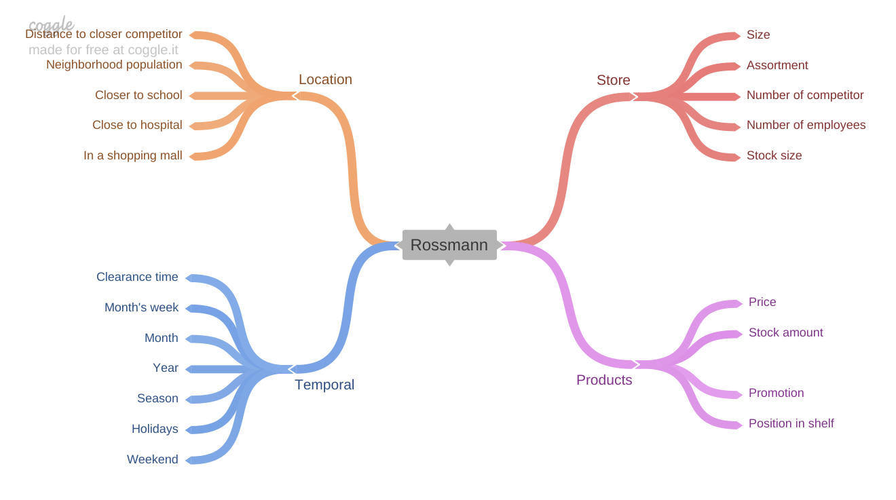 

# Exploratory Data Analysis

## Univariate Analysis

### Categorical Features Distribution Analysis

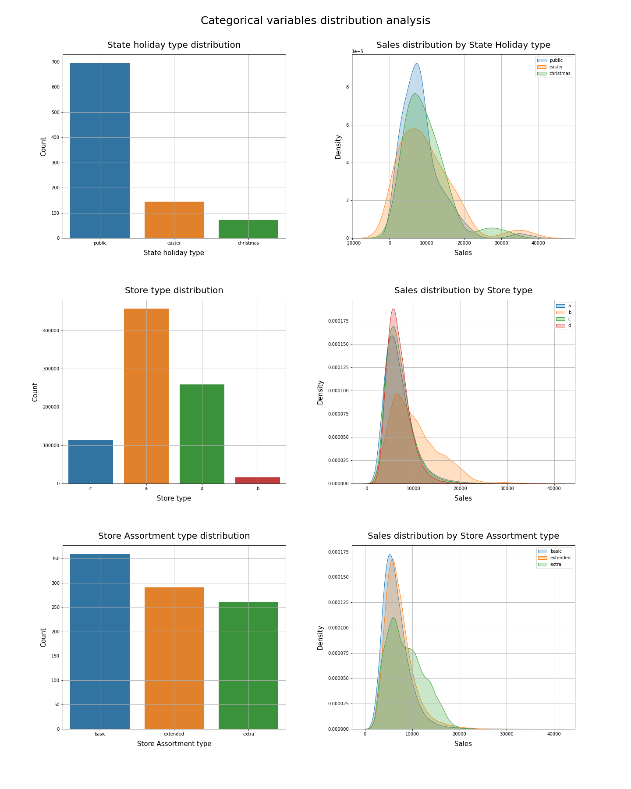 

- There are more registers at public holidays than any other holiday. But its important to notice that even with only a few register at Christmas holiday, its **`sales`** distribution indicates that its daily sales are high.
- There are more registers with stores **type a**, followed by **c, d and b**. The stores types **b, d, c** have almost the same sales distribution. Even with more stores **type a**, they have a wide sales distribution (not so concentrated distribution) and with the dataset restrict informations we can't find the reason.
- There are more **basic** assortment type's stores than **extended** and **extra**. The sales distribution for **basic** and **extended** types are almost the same. **The extra assortment sales distribution being to wide is probably because it has a larger variety of products.**

### Numerical Features Distribution Analysis

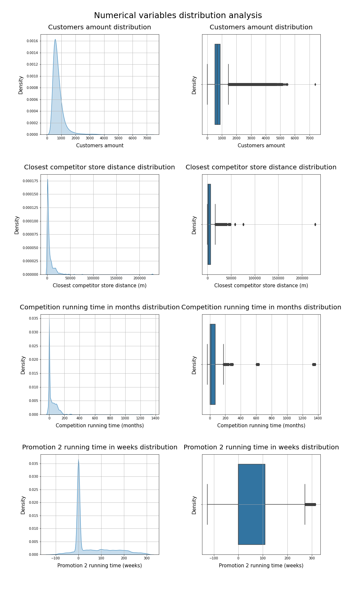 

- The **`customers`** distribution concentrates approximately at 600 clients, considering all stores. **There are only a few stores with over 1000 `customers`.**
- The **`competition_time_month`** distribution concentrates at 0 months, considering all stores. It indicates that, as we saw in section 2.5, a lot of the register's didn't have the information about the closest competitor store inaugural date.
- The **`promo2_time_week`** distribution concentrates at 0 weeks, considering all stores. It indicates that, as we saw in section 2.5, a significant amount of stores aren't adept of Promotion 2. There are some negative values, this is because probably some registers knew the future day that their competitor store would open.
- The **`promo2_time_week`** is the only one without an enormous amount of outliers, compared to the others features.

There are some techniques, that we will see in the next sections, that allow us to transform all these distributions into a shape closer to a normal distribution.

## Bivariate Analysis

### Hypothesis 1: The closer the closest the competitor's store is, the less the Rossmann store sells daily

**FALSE**

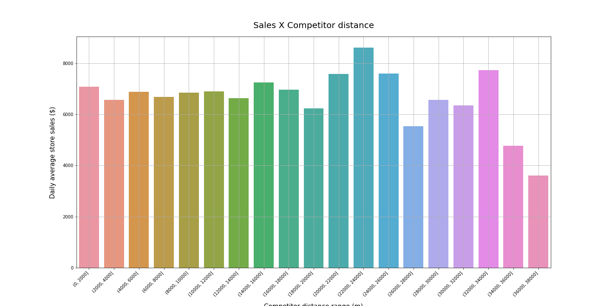 

- There is no pattern that indicates that the daily average sale decreases as closer the competitor store is.
- Also, the behavior varies a lot through the competitor distance range, which sometimes increases the store sales, and sometimes decreases the store sales.

### Hypothesis 2: Stores with more customers are more likely to sell more daily

**TRUE**

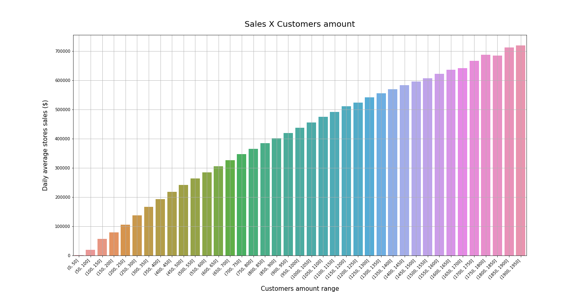 

By looking the big picture (cumulative sales), the more customers the store has, the more it sells daily.

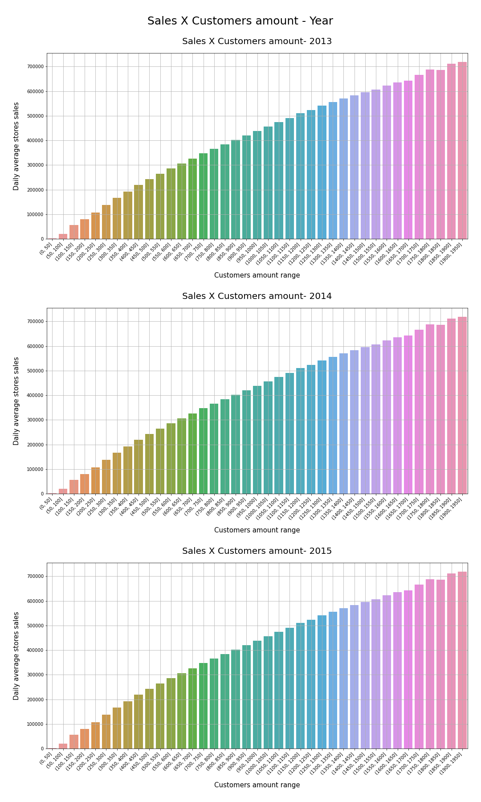 

By looking the daily average sales trough the years, the pattern seen in the cumulative sales is the same, indicating that this behavior - which the stores are more likely to sells more by increasing the customers, is solid and atemporal.

### Hypothesis 3: Stores are more likely sell more in the month's first 10 days than the rest of it

**FALSE**

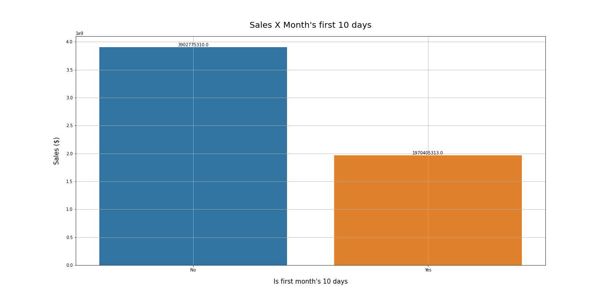 

By looking the big picture (cumulative sales), the store's don't sell more in the first month's 10 days than the rest of the month.

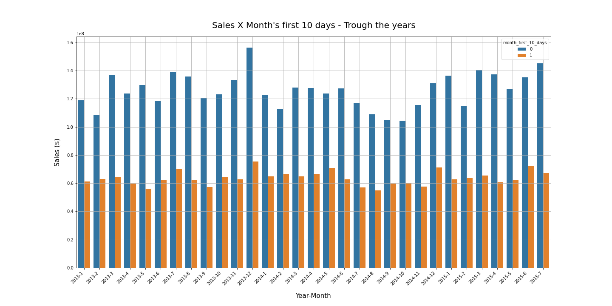 

By looking the daily average sales trough the years, month by month, the pattern seen in the cumulative sales is the same, indicating that this behavior - which the stores are more likely to sells more after the month's 10 days is higher than the sales before the 10th day, is solid and atemporal.

### Hypothesis 4: Stores are more likely to sell more daily in a weekend day than a work week day

**FALSE**

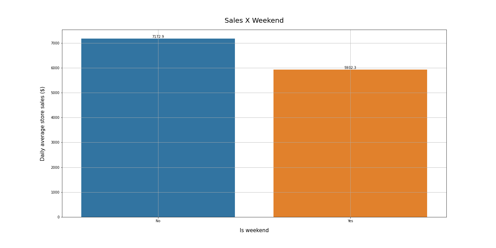 

By looking the big picture (cumulative sales), the stores don't sell more in a weekend day than a work week day. 

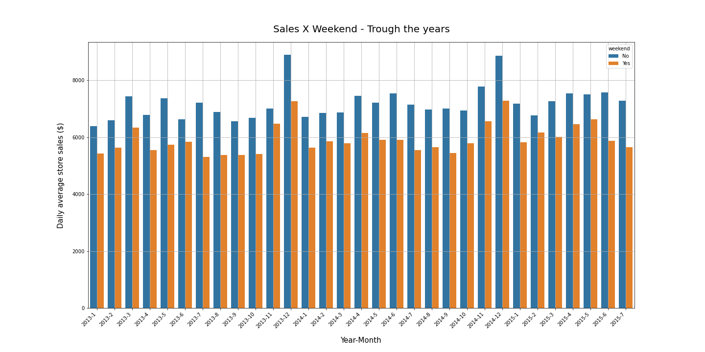 

By looking the daily average sales trough the years, month by month, the pattern seen in the cumulative sales is the same, indicating that this behavior - which the stores are more likely to sells more in a work week day than a weekend day, is solid and atemporal.

### Hypothesis 5: Stores are more likely to increase their daily sales in the winter than any other season

**FALSE**

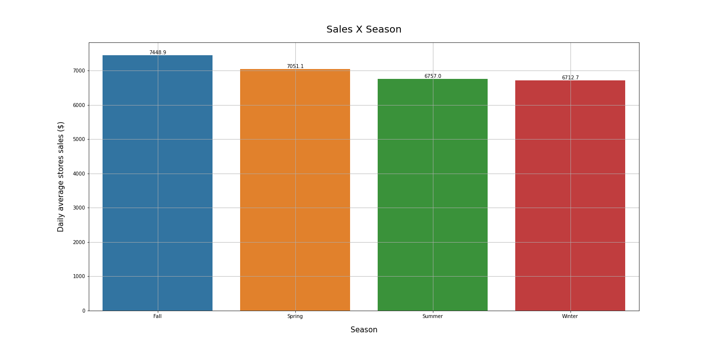 

By looking the big picture (cumulative sales), the stores increases their daily average sales on fall, followed by spring, summer and winter, respectively. 

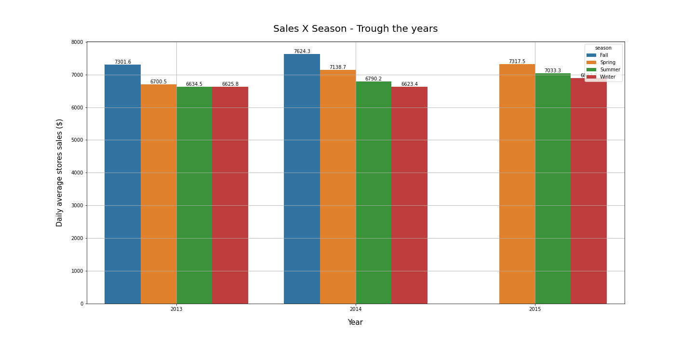 

- By looking the daily average sales trough the years, month by month, the pattern seen in the cumulative sales is the same, indicating that this behavior - which the stores are more likely to sells more on fall followed by spring, summer and winter, is solid and atemporal.
- Is important to notice that the last date in the dataset is 31/07/2015, so there was no fall season at that year. Thats why there is no fall season bar column for 2015 in the graph above.

### Hypothesis 6: Stores are more likely to have their best daily sales in Christmas holiday

**FALSE**

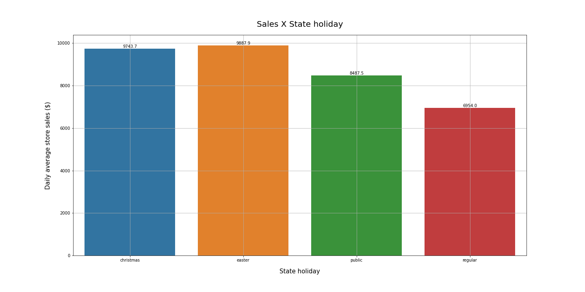 

- By looking the big picture (cumulative sales), the stores increases their daily average sales on easter, followed by christmas and public holidays, respectively. 
- The difference between the daily average sales during easter holiday and christmas holiday is very low, something that is needed to be check through all the years.

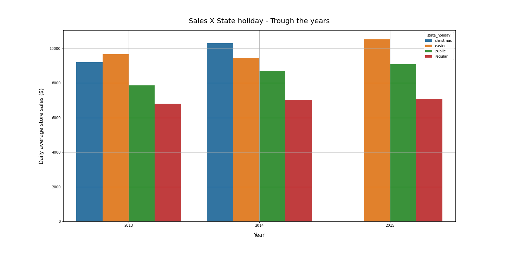 

- By looking the daily average sales trough the years, month by month, the pattern seen in the cumulative sales diverges through the years, indicating that this behavior - which the stores are more likely to sells more at Easter holiday than Christmas holiday, isn't solid and atemporal.
- Is important to notice that the last date in the dataset is 31/07/2015, so there was no christmas holiday at that year. Thats why there is no christmas holiday bar column for 2015 in the graph above.

### Hypothesis 7: Stores daily sales are more likely to increase at the second semester 

**TRUE**

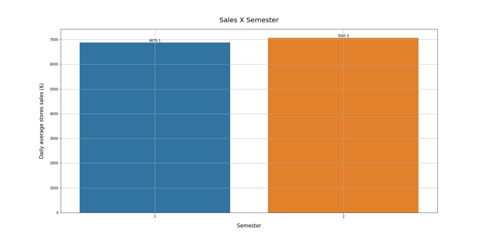 

- By looking the big picture (cumulative sales), the stores increases their daily average sales at the second semester.
- The difference between the daily average sales at the first and second semester is very low, something that is needed to be check through all the years.

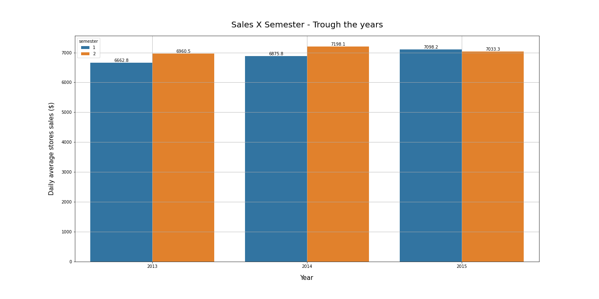 

- By looking the daily average sales trough the years, month by month, the pattern seen in the cumulative sales is the same, indicating that this behavior - which the stores are more likely to sells more at the second semester, is solid and atemporal.
- Is important to notice that the last date in the dataset is 31/07/2015, so there wasn't enough sales at second semester's sales yet. Thats why the second semester for 2015 bar column is smaller than the first semesters column, in the graph above.

### Hypothesis 8: The total stores revenue increases year over year

**FALSE**

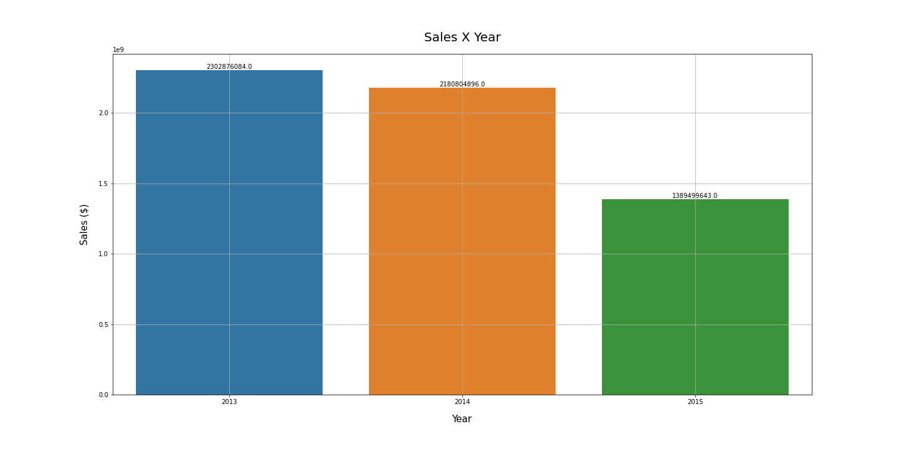 

- The 2015 bar column is so much lower than the others because the last date in the dataset was 31/07/2015, so this total year revenue wasn't complete.
- By looking the graph above, the total Rossmann store's revenue trough the years is going down. But there are just 2 valid year's samples, and more other year's informations are needed to conclude such an affirmative.

### Hypothesis 9: Stores sales are more likely to increase the longer is its promotion 2 running time

**FALSE**

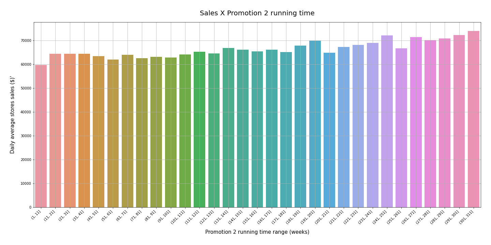 

- There is no pattern that indicates that the daily average sale increases as longer is the promotion 2 running time. 
- Also, the behavior varies a lot through the promotion 2 running time range, which sometimes increases the store sales, and sometimes decreases the store sales.

### Hypothesis 10: Stores daily sales increases the more consecutive promotions it has

**FALSE**

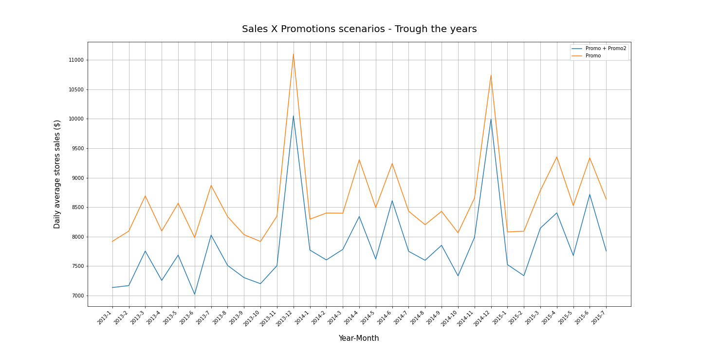 

By looking the daily average sales trough the years, month by month, the pattern seen in the cumulative sales is the same, indicating that this behavior - which the stores are more likely to sells more daily running only promotion **`promo`** than running two promotions, is solid and atemporal.

### Hypothesis 11: Stores daily sales increases the more variate its assortment level is

**TRUE**

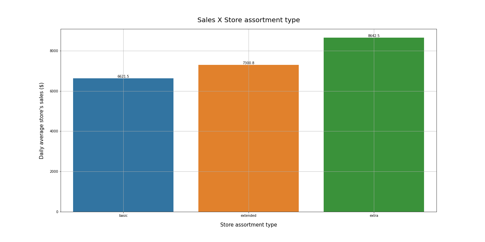 

By looking the big picture (cumulative sales), the stores increases their daily average sales by selling more assorted products.

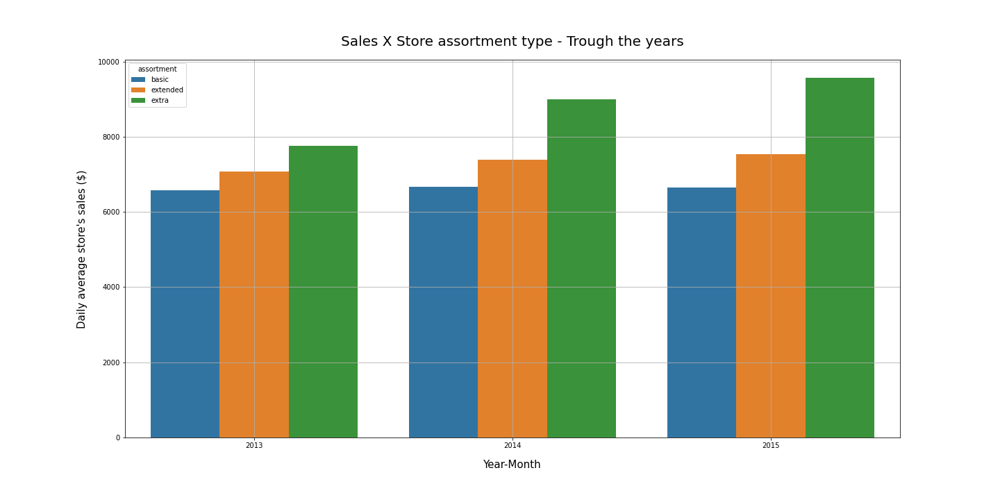 

By looking the daily average sales trough the years, month by month, the pattern seen in the cumulative sales is the same, indicating that this behavior - which the stores are more likely to sells more daily when selling more assorted products, is solid and atemporal.

### Hypothesis 12: Stores sales increases the longer its closest competitor exists

**TRUE**

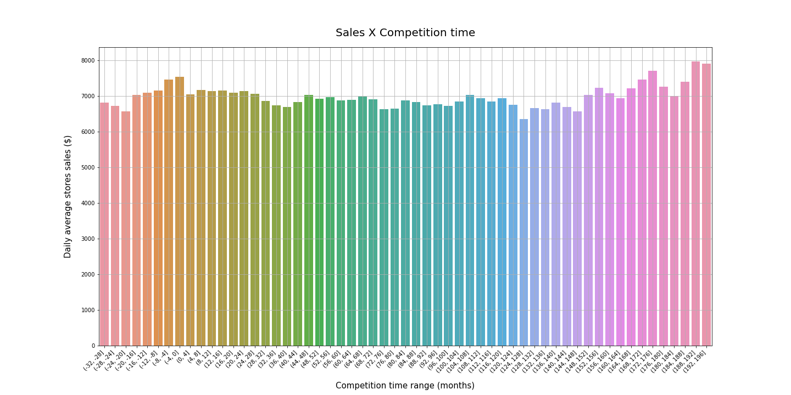 

There are negative and positive values, and we will consider them as the follow: 

- **Stores with negative competition months** are store that already knew when they competitor was going to inaugurate their store in the future.
- **Stores with positive competition months** are store that are already in a competition.
- As seen in section 4.2.1, there isn't a clearly visible sales behavior when considering the competitor's influence, over the Rossmann stores.
- Also, the behavior varies a lot through the competition time range, with sometimes increases the store sales, and sometime decreases the store sales.

### Hypothesis 13: Stores sales increases during the schools holidays

**TRUE**

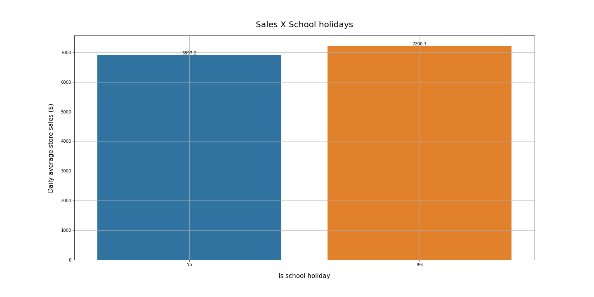 

- By looking the big picture (cumulative sales), the stores increases their daily average sales on school holidays.
- The difference between the daily average sales on school holidays and daily average sales not on school holidays is very low, something that is needed to be check through all the years.

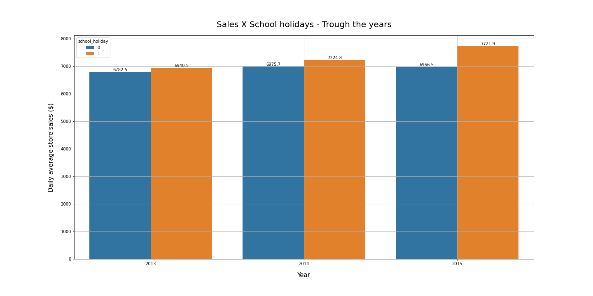 

By looking the daily average sales trough the years, month by month, the pattern seen in the cumulative sales is the same, indicating that this behavior - which the stores are more likely to sells more on school holidays than not on school holidays, is solid and atemporal.

## Multivariate Analysis

### Numerical Features Correlation

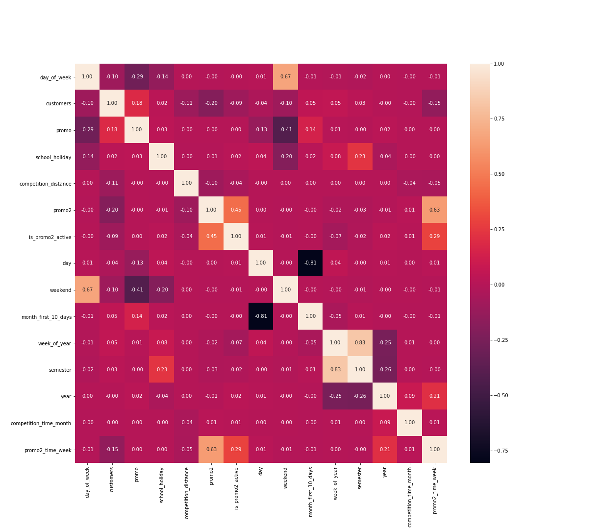 

There aren't variables that have a strong correlation between them, so we don't need to bother to delete them for now.

**There are a few correlated variables, which are:**

- **`weekend`**                and   **`day`**                  (67% correlation)
- **`promo2`**                 and   **`promo2_time_week`**     (63% correlation)
- **`is_promo2_active`**       and   **`promo2`**               (45% correlation)
- **`promo2_time_week`**       and   **`is_promo2_active`**     (45% correlation)

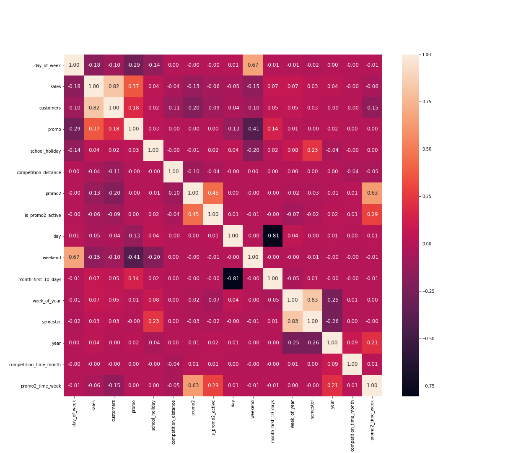 

**There are some numerical variables that have considerable impact over `sales` label value:**

- **`customers`** (82% correlation)
- **`promo`** (37% correlation)
- **`day_of_week`** (-18% correlation)
- **`weekend`** (-15% correlation)
- **`promo2`** (-13% correlation)

### Categorical Features Correlation

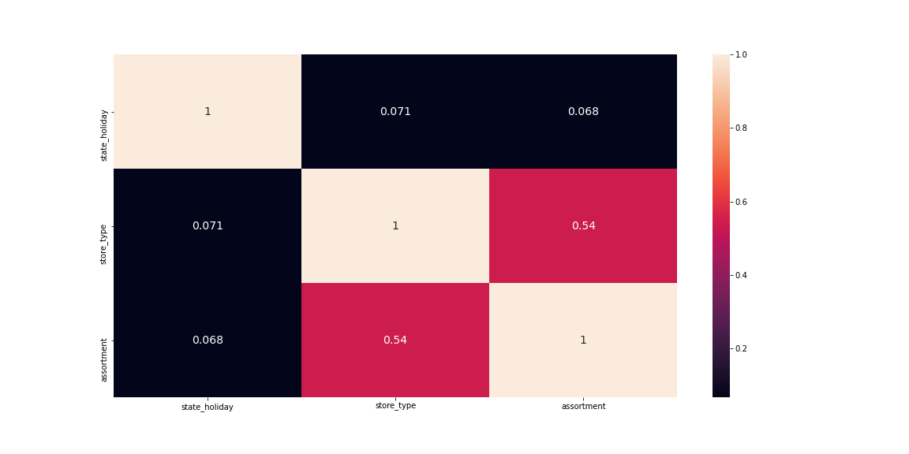 

There aren't variables that have a strong correlation between them, so we don't need to bother to delete them for now.

**There are a few correlated variables, which are:**

- **`assortment`**                and   **`store_type`**                  (54% correlation)

Which makes sense. The larger the store, probably more assorted products it offers.
**There are some variables that have considerable impact over 'is_fraud' result values:**

- **`amount`**
- **`step`**
- **`moth_fortnight`**
- **`amount_level`**
- **`flow_dest`**
- **`is_flagged_fraud`**

# Machine Learning Models Testing

In process...

# Proposed Machine Learning Model

In process...

**OBS:** For more about the decisions made and how it was done: [Rossmann_Sales notebook](https://github.com/pedrofratucci/Rossmann_Sales/blob/main/notebooks/rossmann_sales_ph.ipynb)

# Business Solution Performance

In process...

# Deploy 

The model predictions, store by store, can be found through this chatbot in Telegram:
 - https://web.telegram.org/#/im?p=@pedero_rossmann_bot

# Further Improvements

In process...

# References

## Business Problem Source
- https://www.kaggle.com/c/rossmann-store-sales

## Data Source
- https://www.kaggle.com/c/rossmann-store-sales
